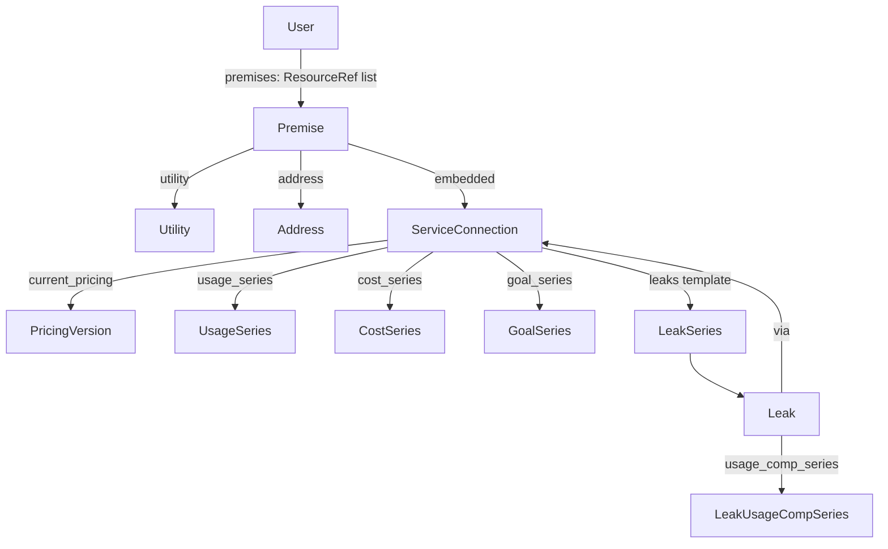

# AGENTS.md

Guidance for AI agents working on this repository.

## Project

Python client library for the Dropcountr water-usage API (`dropcountr-py`, v0.2.0).

Core flow: cookie login → `/api/me` → premises → service connections (meters) → usage/cost/goal/leak series via URI templates.

## Domain relationships



| From | To | How |
|------|----|-----|
| `User` | `Premise` | `premises` are `@id` links only — fetch with `client.premise(ref.id)` |
| `Premise` | `Utility` | Embedded on the premise — use this, not anything on `User` |
| `Premise` | `Address` | Embedded on the premise — use this, not anything on `User` |
| `Premise` | `ServiceConnection` | Embedded on the premise payload |
| `ServiceConnection` | usage / cost / goal | IRI templates `{?during,period}` → `client.usage` / `cost` / `goal` |
| `ServiceConnection` | `Leak` | IRI template `{?during}` → `client.leaks` / `client.leak` |
| `Leak` | meter | `via` → service connection `@id` |
| `Leak` | usage comps | `usage_comp_series` → `client.leak_usage_comps(leak, period, during)` |

Shared value types: `ResourceRef` (`@id`), `IriTemplate`, `Address`, `Quantity`, `Money`.

## Period and during

- **`during`**: exclusive-ended ISO8601 interval `start/end`. The end is **not** included.
  - Example: `2023-01-01/2023-01-04` covers Jan 1, 2, and 3 (three days).
- **`period`**: `hour` | `day` | `week` | `month` | `billing`
  - `billing` is only valid when the `billing_period` feature flag is present on the service connection (also listed on utility features).
  - Constants: `dropcountr.models.PERIODS`, `BILLING_PERIOD_FEATURE`, `Period`.

## Layout

| Path | Purpose |
|------|---------|
| `src/dropcountr/client.py` | `DropcountrClient` — auth, GET helpers, series expansion |
| `src/dropcountr/models.py` | Domain dataclasses parsed from API JSON (`User`, `Premise`, series, …) |
| `src/dropcountr/__init__.py` | Package export (`DropcountrClient`, `models`) |
| `example.py` | End-to-end demo (login, premises, usage/cost/leaks) |
| `pyproject.toml` | Packaging (PyPI name `dropcountr-py`, import `dropcountr`) |
| `requirements.txt` | Dev/example deps: httpx, uritemplate, python-dotenv |
| `env.example` | Credential template (`DROPCOUNTR_EMAIL`, `DROPCOUNTR_PASS`) |

## Setup

```bash
python3 -m venv .venv
source .venv/bin/activate
pip install -r requirements.txt
pip install -e .
cp env.example .env   # then fill in credentials
```

Prefer the project `.venv` when running Python or installing packages.

## Conventions

- Keep the client thin: authenticate, follow API URLs, expand URI templates, parse into `dropcountr.models` dataclasses.
- Use the existing API Accept header: `application/vnd.dropcountr.api+json;version=2`.
- Series methods (`usage` / `cost` / `goal` / `leak_usage_comps`) should keep sharing `_series()`; don't duplicate template expansion.
- `leaks` only takes `during` (no `period`); `leak_usage_comps` takes a `Leak` plus `period` and `during`.
- Prefer `from_dict` on models for parsing; ignore unknown JSON keys to tolerate API drift.
- `Utility` and `Address` live on `Premise` only — do not model or use them from `User` / `/api/me`.
- Time ranges (`during`) are exclusive-ended ISO8601 intervals: `start/end` (end excluded).
- Periods: `hour`, `day`, `week`, `month`, `billing`. Use `billing` only if `billing_period` is in `ServiceConnection.features`.
- Prefer context-manager usage (`with DropcountrClient(...) as client`) in examples and docs.
- Match existing style: type hints, short methods, no unnecessary abstraction.

## Security

- Never commit `.env` or real credentials.
- Do not print passwords or session cookies in examples or logs.
- Treat Dropcountr responses as user-private data.

## Do not

- Add frameworks, CLI scaffolding, or docs the user did not ask for.
- Expand scope beyond the request (drive-by refactors, unrelated cleanup).
- Commit unless the user explicitly asks.
